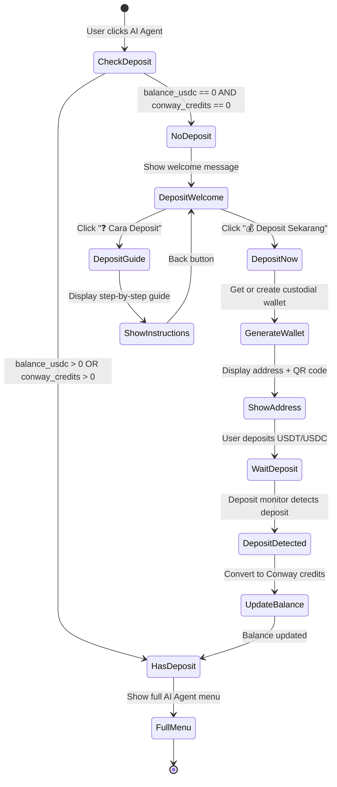

# Design Document: AI Agent Deposit-First Flow

## Overview

This design implements a mandatory deposit-first flow for the AI Agent (Automaton) feature in the Telegram bot. The system checks if users have made a deposit before granting access to AI Agent features. Users without deposits see a welcome message with deposit instructions, while users with deposits access the full AI Agent menu.

The implementation adds two new callback handlers (`automaton_first_deposit` and `deposit_guide`) to the existing menu system, leveraging the current custodial wallet infrastructure and deposit monitoring system.

## Architecture

### System Components

```
┌─────────────────────────────────────────────────────────────┐
│                    Telegram Bot Layer                        │
│  ┌──────────────────────────────────────────────────────┐  │
│  │         MenuCallbackHandler                          │  │
│  │  - handle_callback_query()                           │  │
│  │  - show_ai_agent_menu()                              │  │
│  │  - handle_automaton_first_deposit() [NEW]            │  │
│  │  - handle_deposit_guide() [NEW]                      │  │
│  └──────────────────────────────────────────────────────┘  │
└─────────────────────────────────────────────────────────────┘
                            │
                            ▼
┌─────────────────────────────────────────────────────────────┐
│                   Business Logic Layer                       │
│  ┌──────────────────────────────────────────────────────┐  │
│  │         Database (Supabase)                          │  │
│  │  - custodial_wallets table                           │  │
│  │  - get wallet by user_id                             │  │
│  │  - check balance (USDC + Conway credits)             │  │
│  └──────────────────────────────────────────────────────┘  │
│  ┌──────────────────────────────────────────────────────┐  │
│  │         Wallet Generation                            │  │
│  │  - Generate Ethereum wallet                          │  │
│  │  - Encrypt private key                               │  │
│  │  - Store in custodial_wallets                        │  │
│  └──────────────────────────────────────────────────────┘  │
└─────────────────────────────────────────────────────────────┘
                            │
                            ▼
┌─────────────────────────────────────────────────────────────┐
│                   External Services                          │
│  ┌──────────────────────────────────────────────────────┐  │
│  │         QR Code API                                  │  │
│  │  - api.qrserver.com                                  │  │
│  │  - Generate QR code for wallet address               │  │
│  └──────────────────────────────────────────────────────┘  │
│  ┌──────────────────────────────────────────────────────┐  │
│  │         Deposit Monitor (Existing)                   │  │
│  │  - Monitors blockchain for deposits                  │  │
│  │  - Converts USDT/USDC to Conway credits              │  │
│  │  - Transfers to master wallet                        │  │
│  └──────────────────────────────────────────────────────┘  │
└─────────────────────────────────────────────────────────────┘
```

### Flow Diagram



## Components and Interfaces

### 1. MenuCallbackHandler (menu_handlers.py)

**Existing Methods (Modified)**:
- `handle_callback_query()`: Add routing for new callbacks
- `show_ai_agent_menu()`: Already implements deposit check (no changes needed)

**New Methods**:

```python
async def handle_automaton_first_deposit(self, query, context):
    """
    Handle first deposit flow for AI Agent access
    
    Responsibilities:
    - Get or create user's custodial wallet
    - Display wallet address with QR code
    - Show deposit instructions
    - Explain conversion rates and supported networks
    
    Args:
        query: CallbackQuery from Telegram
        context: Bot context
    
    Returns:
        None (sends message to user)
    """
    pass

async def handle_deposit_guide(self, query, context):
    """
    Display comprehensive deposit guide
    
    Responsibilities:
    - Show step-by-step deposit instructions
    - List supported networks with fees
    - Explain conversion rates
    - Provide troubleshooting tips
    - Show back button to return to deposit flow
    
    Args:
        query: CallbackQuery from Telegram
        context: Bot context
    
    Returns:
        None (sends message to user)
    """
    pass
```

### 2. Database Interface (database.py)

**Existing Methods (Used)**:
- `get_user_language(user_id)`: Get user's language preference
- Supabase query to `custodial_wallets` table

**Database Schema (Existing)**:
```sql
CREATE TABLE custodial_wallets (
    id UUID PRIMARY KEY,
    user_id BIGINT NOT NULL,
    wallet_address TEXT NOT NULL,
    encrypted_private_key TEXT NOT NULL,
    balance_usdc DECIMAL(20, 8) DEFAULT 0,
    conway_credits DECIMAL(20, 2) DEFAULT 0,
    created_at TIMESTAMP DEFAULT NOW(),
    updated_at TIMESTAMP DEFAULT NOW()
);
```

### 3. Wallet Generation (Existing in handlers_automaton.py)

The wallet generation logic already exists in the `spawn_agent_command()` function. We'll reuse this pattern:

```python
# Pseudocode for wallet generation
def get_or_create_custodial_wallet(user_id):
    # Check if wallet exists
    wallet = db.query("SELECT * FROM custodial_wallets WHERE user_id = ?", user_id)
    
    if wallet:
        return wallet
    
    # Generate new wallet
    account = Account.create()
    wallet_address = account.address
    private_key = account.key.hex()
    
    # Encrypt private key
    encrypted_key = encrypt_private_key(private_key)
    
    # Store in database
    db.insert("custodial_wallets", {
        user_id: user_id,
        wallet_address: wallet_address,
        encrypted_private_key: encrypted_key,
        balance_usdc: 0,
        conway_credits: 0
    })
    
    return wallet
```

### 4. QR Code Generation

Uses external API (already implemented in `deposit_command()`):
```python
qr_url = f"https://api.qrserver.com/v1/create-qr-code/?size=300x300&data={wallet_address}"
```

## Data Models

### Custodial Wallet (Existing)

```python
class CustodialWallet:
    id: UUID
    user_id: int  # Telegram user ID
    wallet_address: str  # Ethereum address (0x...)
    encrypted_private_key: str  # AES encrypted
    balance_usdc: Decimal  # USDC balance
    conway_credits: Decimal  # Conway credits balance
    created_at: datetime
    updated_at: datetime
```

### Deposit Check Result

```python
class DepositCheckResult:
    has_deposit: bool  # True if balance > 0
    balance_usdc: Decimal
    conway_credits: Decimal
    wallet_address: str | None
```

## Correctness Properties

*A property is a characteristic or behavior that should hold true across all valid executions of a system—essentially, a formal statement about what the system should do. Properties serve as the bridge between human-readable specifications and machine-verifiable correctness guarantees.*

### Property 1: Deposit Detection Consistency

*For any* user, if they have a custodial wallet with `balance_usdc > 0` OR `conway_credits > 0`, then the system should display the full AI Agent menu instead of the deposit requirement message.

**Validates: Requirements 1.3, 1.4**

### Property 2: Wallet Address Uniqueness

*For any* user, when generating or retrieving a custodial wallet, the returned wallet address should be unique to that user and consistent across multiple calls.

**Validates: Requirements 5.5**

### Property 3: QR Code Generation Correctness

*For any* valid Ethereum wallet address, the generated QR code URL should contain the exact wallet address and be scannable to produce the same address.

**Validates: Requirements 6.2, 6.3**

### Property 4: Callback Routing Correctness

*For any* callback query with data `automaton_first_deposit` or `deposit_guide`, the system should route to the correct handler function without errors.

**Validates: Requirements 7.1, 7.2, 7.3**

### Property 5: Language Consistency

*For any* user interaction in the deposit flow, all messages should be displayed in the user's preferred language (Indonesian or English) consistently throughout the flow.

**Validates: Requirements 2.1, 2.2, 2.3, 2.4, 2.5**

### Property 6: Minimum Deposit Display

*For any* deposit instruction message (first deposit or guide), the minimum deposit amount of 5 USDT/USDC should be clearly displayed.

**Validates: Requirements 9.1, 9.2, 9.3**

### Property 7: Conversion Rate Display

*For any* deposit instruction message, the conversion rate "1 USDT/USDC = 100 Conway Credits" should be clearly displayed with examples.

**Validates: Requirements 10.1, 10.2, 10.3**

### Property 8: Supported Networks Display

*For any* deposit guide message, all three supported networks (Polygon, Base, Arbitrum) should be listed with Polygon marked as recommended.

**Validates: Requirements 8.1, 8.2, 8.3, 8.4**

### Property 9: Wallet Creation Idempotence

*For any* user, calling the wallet generation function multiple times should return the same wallet address without creating duplicates.

**Validates: Requirements 5.5**

### Property 10: Deposit Address Display Format

*For any* deposit address display, the address should be shown as copyable monospace text and accompanied by a QR code image.

**Validates: Requirements 6.1, 6.2, 6.3**

## Error Handling

### Error Scenarios

1. **Supabase Connection Failure**
   - Fallback: Show error message with retry option
   - Log error for admin review
   - User message: "❌ Database connection error. Please try again."

2. **Wallet Generation Failure**
   - Fallback: Show error message and suggest contacting support
   - Log error with user ID for investigation
   - User message: "❌ Failed to generate wallet. Please contact support."

3. **QR Code API Failure**
   - Fallback: Show wallet address without QR code
   - User can still copy address manually
   - User message: "⚠️ QR code unavailable. Please copy address manually."

4. **Invalid Callback Data**
   - Fallback: Return to main menu
   - Log unexpected callback data
   - User message: "❌ Invalid action. Returning to main menu."

5. **User Not Found**
   - Fallback: Prompt user to use /start command
   - User message: "❌ User not found. Please use /start to register."

### Error Handling Pattern

```python
try:
    # Main logic
    result = perform_operation()
    if not result:
        await send_error_message(user, "Operation failed")
        return
    
    # Success path
    await send_success_message(user, result)
    
except DatabaseError as e:
    logger.error(f"Database error: {e}")
    await send_error_message(user, "Database error. Please try again.")
    
except WalletGenerationError as e:
    logger.error(f"Wallet generation error: {e}")
    await send_error_message(user, "Wallet generation failed. Contact support.")
    
except Exception as e:
    logger.error(f"Unexpected error: {e}")
    await send_error_message(user, "Unexpected error. Please try again.")
```

## Testing Strategy

### Unit Tests

Unit tests focus on specific examples, edge cases, and error conditions:

1. **Deposit Check Logic**
   - Test user with zero balance (should show deposit message)
   - Test user with USDC balance only (should show full menu)
   - Test user with Conway credits only (should show full menu)
   - Test user with both balances (should show full menu)
   - Test user without wallet (should show deposit message)

2. **Callback Routing**
   - Test `automaton_first_deposit` callback routes correctly
   - Test `deposit_guide` callback routes correctly
   - Test invalid callback data handling
   - Test callback with missing user context

3. **Message Formatting**
   - Test Indonesian language messages
   - Test English language messages
   - Test QR code URL generation
   - Test wallet address formatting

4. **Error Handling**
   - Test Supabase connection failure
   - Test wallet generation failure
   - Test QR code API failure
   - Test user not found scenario

### Property-Based Tests

Property-based tests verify universal properties across all inputs (minimum 100 iterations per test):

1. **Property Test: Deposit Detection Consistency**
   - Generate random wallet states (various balance combinations)
   - Verify deposit check returns correct result for each state
   - Tag: **Feature: ai-agent-deposit-flow, Property 1: Deposit Detection Consistency**

2. **Property Test: Wallet Address Uniqueness**
   - Generate multiple users
   - Create wallets for each user
   - Verify all wallet addresses are unique
   - Verify repeated calls return same address for same user
   - Tag: **Feature: ai-agent-deposit-flow, Property 2: Wallet Address Uniqueness**

3. **Property Test: QR Code URL Correctness**
   - Generate random valid Ethereum addresses
   - Create QR code URLs for each
   - Verify URL contains exact address
   - Verify URL format is correct
   - Tag: **Feature: ai-agent-deposit-flow, Property 3: QR Code Generation Correctness**

4. **Property Test: Callback Routing**
   - Generate callback queries with valid callback data
   - Verify each routes to correct handler
   - Verify no exceptions are raised
   - Tag: **Feature: ai-agent-deposit-flow, Property 4: Callback Routing Correctness**

5. **Property Test: Language Consistency**
   - Generate users with different language preferences
   - Verify all messages use correct language
   - Verify no language mixing occurs
   - Tag: **Feature: ai-agent-deposit-flow, Property 5: Language Consistency**

6. **Property Test: Required Information Display**
   - Generate deposit instruction messages
   - Verify minimum deposit amount is present
   - Verify conversion rate is present
   - Verify all supported networks are listed
   - Tag: **Feature: ai-agent-deposit-flow, Property 6-8: Information Display**

7. **Property Test: Wallet Creation Idempotence**
   - Generate random users
   - Call wallet creation multiple times for each user
   - Verify same wallet address returned each time
   - Verify no duplicate wallets created
   - Tag: **Feature: ai-agent-deposit-flow, Property 9: Wallet Creation Idempotence**

### Integration Tests

1. **End-to-End Deposit Flow**
   - Simulate user clicking AI Agent button
   - Verify deposit check occurs
   - Simulate clicking deposit button
   - Verify wallet generation and display
   - Verify QR code generation

2. **Deposit Guide Flow**
   - Simulate user clicking deposit guide button
   - Verify guide displays correctly
   - Verify back button returns to deposit flow

3. **Post-Deposit Access**
   - Simulate user with deposit
   - Verify full AI Agent menu displays
   - Verify no deposit message shown

### Testing Configuration

- **Property test iterations**: Minimum 100 per test
- **Test framework**: pytest for Python
- **Property testing library**: Hypothesis (Python)
- **Coverage target**: 90% for new code
- **CI/CD**: Run all tests on every commit

## Implementation Notes

### Code Reuse

1. **Wallet Generation**: Reuse pattern from `spawn_agent_command()` in `handlers_automaton.py`
2. **QR Code Generation**: Reuse pattern from `deposit_command()` in `handlers_automaton.py`
3. **Deposit Check**: Already implemented in `show_ai_agent_menu()` in `menu_handlers.py`
4. **Language Support**: Use existing `get_user_language()` from `database.py`

### Security Considerations

1. **Private Key Encryption**: Use existing encryption mechanism (already implemented)
2. **Wallet Address Validation**: Validate Ethereum address format (0x + 40 hex characters)
3. **SQL Injection Prevention**: Use parameterized queries (already implemented in Supabase client)
4. **Rate Limiting**: Not required for this feature (read-only operations)

### Performance Considerations

1. **Database Queries**: Single query to check wallet balance (already optimized)
2. **QR Code Generation**: External API call (cached by Telegram)
3. **Wallet Generation**: Only occurs once per user (idempotent)
4. **Message Formatting**: Minimal string operations (negligible overhead)

### Deployment Considerations

1. **Database Migration**: No schema changes required (uses existing tables)
2. **Environment Variables**: No new variables required
3. **Dependencies**: No new dependencies required
4. **Backward Compatibility**: Fully compatible with existing code
5. **Rollback Plan**: Simple code revert (no data migration needed)
