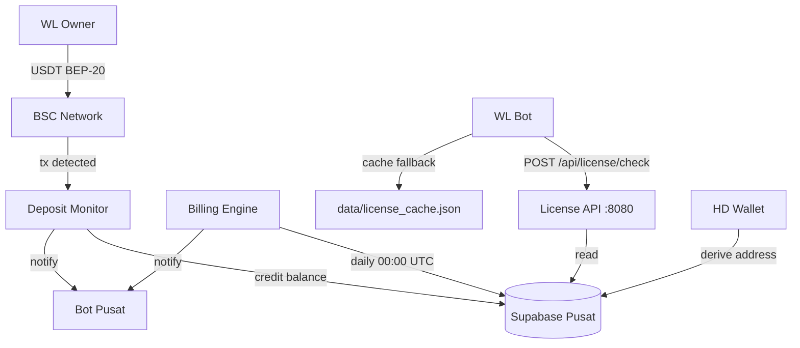
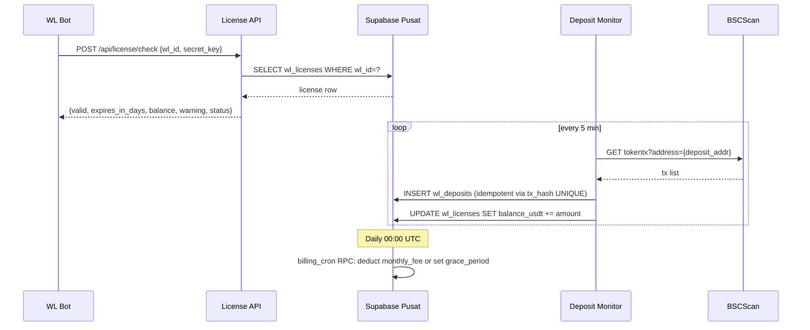

# Design Document: Whitelabel License Billing

## Overview

Sistem billing otomatis B2B untuk CryptoMentor Whitelabel. Central_Server mengelola seluruh lifecycle lisensi: generate deposit address unik per WL via HD Wallet, deteksi deposit USDT BEP-20 secara otomatis via BSCScan, auto-billing bulanan, dan License API yang dikonsumsi oleh setiap WL_Bot untuk validasi lisensi.

Arsitektur ini memisahkan tanggung jawab secara tegas: Central_Server adalah sumber kebenaran tunggal (single source of truth) untuk semua data lisensi, sementara WL_Bot hanya menjadi consumer yang memvalidasi status via REST API dengan fallback cache lokal.



## Architecture

### Deployment Topology

```
Central_Server (Ubuntu VPS)
├── license_server/
│   ├── license_api.py        # FastAPI, port 8080, systemd service
│   ├── deposit_monitor.py    # asyncio polling loop, systemd service
│   ├── billing_cron.py       # APScheduler daily job, systemd service
│   ├── wallet_manager.py     # HD Wallet utility (no network I/O)
│   ├── license_manager.py    # Supabase CRUD layer
│   └── db/
│       └── setup.sql         # Schema DDL
└── .env                      # MASTER_SEED_MNEMONIC, SUPABASE_*, BSCSCAN_API_KEY

WL_Bot Server (per WL instance)
└── Whitelabel #1/
    └── app/
        └── license_guard.py  # Startup check + 24h periodic check
```

### Component Interaction Flow



## Components and Interfaces

### 1. HD Wallet Manager (`wallet_manager.py`)

Stateless utility — tidak ada I/O jaringan, hanya derivasi kriptografi.

```python
class HDWalletManager:
    def __init__(self, mnemonic: str)
    def derive_address(self, index: int) -> str
        # Returns checksummed BSC/ETH address
        # Path: m/44'/60'/0'/0/{index}
    def get_next_index(self, used_indices: list[int]) -> int
        # Returns min unused index >= 0
```

Library: `bip_utils` untuk BIP-44 derivation, `eth_account` untuk address formatting.

Derivation path `m/44'/60'/0'/0/{index}` kompatibel dengan MetaMask default ETH/BSC path sehingga semua WL address dapat diakses dari satu wallet MetaMask menggunakan Master_Seed yang sama.

### 2. License Manager (`license_manager.py`)

CRUD layer ke Supabase pusat. Semua operasi write menggunakan service role key.

```python
class LicenseManager:
    async def register_wl(self, admin_telegram_id: int, monthly_fee: float) -> dict
        # Generates: secret_key (UUID v4), deposit_index, deposit_address
        # Returns: wl_id, secret_key, deposit_address

    async def get_license(self, wl_id: str) -> dict | None

    async def credit_balance(self, wl_id: str, amount: float, tx_hash: str,
                              block_number: int) -> bool
        # Atomic: INSERT wl_deposits + UPDATE wl_licenses.balance_usdt
        # Idempotent: returns False if tx_hash already exists

    async def debit_billing(self, wl_id: str) -> dict
        # Calls Supabase RPC `process_billing` (atomic)
        # Returns: {success, balance_before, balance_after, new_status, expires_at}
```

### 3. Deposit Monitor (`deposit_monitor.py`)

Asyncio polling loop. Berjalan sebagai systemd service terpisah.

```python
class DepositMonitor:
    POLL_INTERVAL = 300  # 5 menit
    USDT_CONTRACT = "0x55d398326f99059fF775485246999027B3197955"
    MIN_CONFIRMATIONS = 12

    async def run(self)
        # Main loop: poll semua active deposit addresses

    async def poll_address(self, wl_id: str, address: str)
        # GET BSCScan tokentx, filter USDT, check confirmations

    async def process_tx(self, wl_id: str, tx: dict)
        # Idempotent credit via license_manager.credit_balance()
        # Notify WL Owner via bot pusat on success
```

BSCScan API endpoint:
```
GET https://api.bscscan.com/api
  ?module=account&action=tokentx
  &contractaddress=0x55d398326f99059fF775485246999027B3197955
  &address={deposit_address}
  &sort=desc
  &apikey={BSCSCAN_API_KEY}
```

Retry strategy: exponential backoff `[1s, 2s, 4s]` maksimal 3 kali per address per cycle.

### 4. Billing Engine (`billing_cron.py`)

APScheduler dengan `AsyncIOScheduler`, trigger `CronTrigger(hour=0, minute=0, timezone='UTC')`.

```python
async def run_billing_cycle()
    # Query: SELECT * FROM wl_licenses
    #   WHERE status IN ('active', 'grace_period')
    #   AND expires_at <= NOW()
    # For each WL: call Supabase RPC process_billing(wl_id)
    # Log summary: total, success, failed, suspended
```

Atomicity dijamin via Supabase RPC `process_billing` yang berjalan dalam satu database transaction.

### 5. License API (`license_api.py`)

FastAPI app, port 8080, systemd service.

```python
POST /api/license/check
  Body: {"wl_id": str, "secret_key": str}
  Response 200: {"valid": bool, "expires_in_days": int, "balance": float,
                 "warning": bool, "status": str}
  Response 400: {"error": "invalid_request"}   # secret_key bukan UUID v4
  Response 401: {"error": "unauthorized"}
  Response 404: {"error": "not_found"}
```

Rate limiting via `slowapi`: 60 req/menit per `wl_id` (key func dari request body).

Validasi awal: regex UUID v4 sebelum query DB untuk mencegah unnecessary DB load.

### 6. License Guard (`Whitelabel #1/app/license_guard.py`)

Async component yang diinisialisasi saat WL_Bot startup.

```python
class LicenseGuard:
    CHECK_INTERVAL = 86400      # 24 jam
    CACHE_MAX_AGE  = 172800     # 48 jam
    API_TIMEOUT    = 10         # detik
    CACHE_FILE     = "data/license_cache.json"

    async def startup_check(self) -> bool
        # Returns True jika bot boleh jalan

    async def periodic_check_loop(self)
        # asyncio loop, check setiap 24 jam

    def _load_cache(self) -> dict | None
    def _save_cache(self, response: dict)
    async def _call_api(self) -> dict | None
```

Cache file format:
```json
{
  "valid": true,
  "status": "active",
  "expires_in_days": 25,
  "balance": 150.0,
  "warning": false,
  "cached_at": "2025-01-15T00:00:00Z"
}
```

## Data Models

### Database Schema (`db/setup.sql`)

```sql
-- Enum types
CREATE TYPE wl_status AS ENUM ('active', 'grace_period', 'suspended', 'inactive');
CREATE TYPE billing_status AS ENUM ('success', 'failed');

-- Tabel utama lisensi
CREATE TABLE wl_licenses (
    wl_id           UUID PRIMARY KEY DEFAULT gen_random_uuid(),
    balance_usdt    DECIMAL(18, 6)  NOT NULL DEFAULT 0 CHECK (balance_usdt >= 0),
    expires_at      TIMESTAMPTZ     NOT NULL,
    status          wl_status       NOT NULL DEFAULT 'inactive',
    monthly_fee     DECIMAL(10, 2)  NOT NULL DEFAULT 100,
    deposit_address VARCHAR(42)     NOT NULL,
    deposit_index   INTEGER         NOT NULL UNIQUE,
    secret_key      UUID            NOT NULL UNIQUE DEFAULT gen_random_uuid(),
    admin_telegram_id BIGINT        NOT NULL,
    created_at      TIMESTAMPTZ     NOT NULL DEFAULT NOW()
);

-- Riwayat deposit (idempotency via tx_hash UNIQUE)
CREATE TABLE wl_deposits (
    id              BIGSERIAL PRIMARY KEY,
    wl_id           UUID            NOT NULL REFERENCES wl_licenses(wl_id),
    tx_hash         VARCHAR(66)     NOT NULL UNIQUE,
    amount_usdt     DECIMAL(18, 6)  NOT NULL,
    block_number    BIGINT          NOT NULL,
    confirmed_at    TIMESTAMPTZ     NOT NULL,
    created_at      TIMESTAMPTZ     NOT NULL DEFAULT NOW()
);

-- Riwayat billing
CREATE TABLE wl_billing_history (
    id              BIGSERIAL PRIMARY KEY,
    wl_id           UUID            NOT NULL REFERENCES wl_licenses(wl_id),
    amount_usdt     DECIMAL(10, 2)  NOT NULL,
    billing_date    DATE            NOT NULL DEFAULT CURRENT_DATE,
    status          billing_status  NOT NULL,
    balance_before  DECIMAL(18, 6)  NOT NULL,
    balance_after   DECIMAL(18, 6)  NOT NULL,
    expires_at_before TIMESTAMPTZ,
    expires_at_after  TIMESTAMPTZ,
    created_at      TIMESTAMPTZ     NOT NULL DEFAULT NOW()
);

-- Indexes
CREATE INDEX idx_wl_deposits_wl_id ON wl_deposits(wl_id);
CREATE INDEX idx_wl_billing_wl_id ON wl_billing_history(wl_id);
CREATE INDEX idx_wl_licenses_status ON wl_licenses(status);

-- RLS: hanya service role yang bisa write
ALTER TABLE wl_licenses ENABLE ROW LEVEL SECURITY;
ALTER TABLE wl_deposits ENABLE ROW LEVEL SECURITY;
ALTER TABLE wl_billing_history ENABLE ROW LEVEL SECURITY;

CREATE POLICY "service_only_write" ON wl_licenses
    FOR ALL USING (auth.role() = 'service_role');
CREATE POLICY "service_only_write" ON wl_deposits
    FOR ALL USING (auth.role() = 'service_role');
CREATE POLICY "service_only_write" ON wl_billing_history
    FOR ALL USING (auth.role() = 'service_role');

-- Atomic billing RPC
CREATE OR REPLACE FUNCTION process_billing(p_wl_id UUID)
RETURNS JSON LANGUAGE plpgsql AS $$
DECLARE
    lic         wl_licenses%ROWTYPE;
    bal_before  DECIMAL;
    bal_after   DECIMAL;
    exp_before  TIMESTAMPTZ;
    exp_after   TIMESTAMPTZ;
    new_status  wl_status;
    result      JSON;
BEGIN
    SELECT * INTO lic FROM wl_licenses WHERE wl_id = p_wl_id FOR UPDATE;

    bal_before := lic.balance_usdt;
    exp_before := lic.expires_at;

    IF lic.balance_usdt >= lic.monthly_fee THEN
        bal_after  := lic.balance_usdt - lic.monthly_fee;
        exp_after  := lic.expires_at + INTERVAL '30 days';
        new_status := 'active';

        UPDATE wl_licenses
        SET balance_usdt = bal_after,
            expires_at   = exp_after,
            status       = new_status
        WHERE wl_id = p_wl_id;

        INSERT INTO wl_billing_history
            (wl_id, amount_usdt, status, balance_before, balance_after,
             expires_at_before, expires_at_after)
        VALUES
            (p_wl_id, lic.monthly_fee, 'success', bal_before, bal_after,
             exp_before, exp_after);
    ELSE
        bal_after  := bal_before;
        exp_after  := exp_before;
        new_status := 'grace_period';

        UPDATE wl_licenses
        SET status = new_status
        WHERE wl_id = p_wl_id AND status != 'grace_period';

        INSERT INTO wl_billing_history
            (wl_id, amount_usdt, status, balance_before, balance_after,
             expires_at_before, expires_at_after)
        VALUES
            (p_wl_id, lic.monthly_fee, 'failed', bal_before, bal_after,
             exp_before, exp_after);
    END IF;

    result := json_build_object(
        'success',        new_status = 'active',
        'balance_before', bal_before,
        'balance_after',  bal_after,
        'new_status',     new_status,
        'expires_at',     exp_after
    );
    RETURN result;
END;
$$;
```

### Environment Variables

**Central_Server `.env`:**
```
MASTER_SEED_MNEMONIC=<24-word BIP-39 mnemonic>
SUPABASE_URL=https://xxx.supabase.co
SUPABASE_SERVICE_KEY=<REDACTED_SUPABASE_KEY>
BSCSCAN_API_KEY=<api key>
BOT_TOKEN=<bot pusat token>
LICENSE_API_PORT=8080
```

**WL_Bot `.env`:**
```
WL_ID=<uuid>
WL_SECRET_KEY=<REDACTED_WL_SECRET_KEY> v4>
LICENSE_API_URL=https://license.cryptomentor.ai
```


## Correctness Properties

*A property is a characteristic or behavior that should hold true across all valid executions of a system — essentially, a formal statement about what the system should do. Properties serve as the bridge between human-readable specifications and machine-verifiable correctness guarantees.*

### Property 1: HD Wallet Derivation Determinism

*For any* valid BIP-39 mnemonic and any non-negative integer index, deriving the BSC address twice from the same mnemonic and index must produce identical checksummed addresses.

**Validates: Requirements 1.1**

---

### Property 2: Deposit Index Uniqueness

*For any* sequence of WL Owner registrations, no two registrations shall share the same `deposit_index` or `deposit_address`.

**Validates: Requirements 1.2, 1.3**

---

### Property 3: Secret Key Format

*For any* new WL Owner registration, the generated `secret_key` must match the UUID v4 format regex `^[0-9a-f]{8}-[0-9a-f]{4}-4[0-9a-f]{3}-[89ab][0-9a-f]{3}-[0-9a-f]{12}$`.

**Validates: Requirements 3.5**

---

### Property 4: Deposit Confirmation Threshold

*For any* BSC transaction with fewer than 12 block confirmations, the deposit monitor must not credit the balance or insert a deposit record. *For any* transaction with 12 or more confirmations, it must be eligible for processing.

**Validates: Requirements 2.2**

---

### Property 5: Deposit Credit Round-Trip

*For any* verified USDT BEP-20 transaction of amount A credited to WL with initial balance B, the resulting balance must equal B + A, and a corresponding record must exist in `wl_deposits` with the correct `tx_hash` and `amount_usdt`.

**Validates: Requirements 2.3**

---

### Property 6: Deposit Idempotency

*For any* `tx_hash` that has already been processed, processing it again must not change `balance_usdt` and must not insert a duplicate row in `wl_deposits`. The operation must return without error.

**Validates: Requirements 2.4**

---

### Property 7: Billing Success Outcome

*For any* WL license where `balance_usdt >= monthly_fee` and `expires_at <= NOW()`, after running the billing cycle: `balance_usdt` decreases by exactly `monthly_fee`, `expires_at` increases by exactly 30 days, `status` remains `active`, and a `wl_billing_history` record with `status = 'success'` is inserted.

**Validates: Requirements 4.3**

---

### Property 8: Billing Failure Outcome

*For any* WL license where `balance_usdt < monthly_fee` and `expires_at <= NOW()`, after running the billing cycle: `balance_usdt` is unchanged, `status` becomes `grace_period`, and a `wl_billing_history` record with `status = 'failed'` is inserted.

**Validates: Requirements 4.4**

---

### Property 9: Grace Period to Suspended Transition

*For any* WL license with `status = 'grace_period'` where the first grace_period billing_history entry is older than 3 days, the billing engine must transition `status` to `suspended`.

**Validates: Requirements 4.5**

---

### Property 10: License Guard Allow on Valid Response

*For any* API response where `valid = true`, `LicenseGuard.startup_check()` must return `True` (allow bot to run).

**Validates: Requirements 5.2**

---

### Property 11: License Guard Deny on Suspended Response

*For any* API response where `valid = false` and `status = 'suspended'`, `LicenseGuard.startup_check()` must return `False` (halt bot).

**Validates: Requirements 5.4**

---

### Property 12: Cache Persistence Round-Trip

*For any* valid API response saved to the cache file, loading the cache file after a simulated restart must produce an equivalent response object with a `cached_at` timestamp.

**Validates: Requirements 5.7**

---

### Property 13: API Valid Credentials Response Shape

*For any* existing `wl_id` with a matching `secret_key`, `POST /api/license/check` must return HTTP 200 with a JSON body containing all required fields: `valid`, `expires_in_days`, `balance`, `warning`, `status`.

**Validates: Requirements 6.2**

---

### Property 14: API Unauthorized Response

*For any* existing `wl_id` paired with a `secret_key` that does not match, `POST /api/license/check` must return HTTP 401 with `{"error": "unauthorized"}`.

**Validates: Requirements 6.3**

---

### Property 15: API Not Found Response

*For any* `wl_id` that does not exist in the database (paired with any valid UUID v4 secret_key), `POST /api/license/check` must return HTTP 404 with `{"error": "not_found"}`.

**Validates: Requirements 6.4**

---

### Property 16: Warning Field Logic

*For any* license where `expires_in_days <= 5` OR `balance_usdt < monthly_fee`, the API response must include `warning: true`. *For any* license where both conditions are false, `warning` must be `false`.

**Validates: Requirements 6.5**

---

### Property 17: Invalid Secret Key Format Returns 400

*For any* request where `secret_key` is not a valid UUID v4 string (e.g., empty string, arbitrary text, malformed UUID), `POST /api/license/check` must return HTTP 400 with `{"error": "invalid_request"}` without performing any database query.

**Validates: Requirements 6.8**

---

### Property 18: Balance Non-Negative Invariant

*For any* sequence of billing operations on a WL license, `balance_usdt` must never become negative. If a billing deduction would result in a negative balance, the operation must record `status = 'failed'` and leave `balance_usdt` unchanged.

**Validates: Requirements 7.4**

---

## Error Handling

### Deposit Monitor

| Scenario | Behavior |
|---|---|
| BSCScan API error / rate limit | Exponential backoff: 1s → 2s → 4s, max 3 retries. Log error, skip address, continue to next. |
| Duplicate tx_hash | `credit_balance()` returns `False` silently. No exception raised. |
| Supabase write failure | Log error with wl_id and tx_hash. Do NOT mark tx as processed. Will retry on next poll cycle. |
| Invalid USDT amount (0 or negative) | Skip transaction, log warning. |

### Billing Engine

| Scenario | Behavior |
|---|---|
| Supabase RPC failure for one WL | Log error, continue to next WL. Partial failures do not abort the cycle. |
| WL already in correct state | RPC is idempotent; no duplicate billing_history records due to `billing_date` + `wl_id` check. |
| Telegram notification failure | Log warning, do not fail the billing operation. Notification is best-effort. |

### License Guard

| Scenario | Behavior |
|---|---|
| API timeout (> 10s) | Use cache if age < 48h. Log warning. |
| API returns 5xx | Treat as network error, use cache fallback. |
| Cache file corrupted/missing | Treat as cache miss. If API also unavailable, halt bot. |
| Cache age > 48h + API unavailable | Halt bot, send Telegram notification to admin. |

### License API

| Scenario | Behavior |
|---|---|
| Supabase connection failure | Return HTTP 503 `{"error": "service_unavailable"}`. |
| Rate limit exceeded | Return HTTP 429 `{"error": "rate_limit_exceeded"}`. |
| Malformed JSON body | FastAPI returns HTTP 422 automatically. |

### HD Wallet Manager

| Scenario | Behavior |
|---|---|
| Missing MASTER_SEED_MNEMONIC | Raise `RuntimeError` at startup. Central_Server refuses to start. |
| Invalid mnemonic (wrong checksum) | Raise `ValueError` at startup. |

## Testing Strategy

### Dual Testing Approach

Both unit tests and property-based tests are required. They are complementary:
- Unit tests cover specific examples, integration points, and edge cases
- Property tests verify universal correctness across randomized inputs

### Property-Based Testing

Library: **`hypothesis`** (Python)

Each property test runs minimum **100 iterations** (configured via `@settings(max_examples=100)`).

Each test is tagged with a comment referencing the design property:
```python
# Feature: whitelabel-license-billing, Property 1: HD Wallet Derivation Determinism
```

**Property test mapping:**

| Property | Test | Hypothesis Strategy |
|---|---|---|
| P1: HD Wallet Determinism | `test_wallet_derivation_deterministic` | `st.integers(min_value=0, max_value=10000)` for index |
| P2: Deposit Index Uniqueness | `test_deposit_index_unique` | `st.lists(st.integers(...), min_size=2, unique=True)` |
| P3: Secret Key UUID v4 | `test_secret_key_format` | Run N registrations, check all keys |
| P4: Confirmation Threshold | `test_confirmation_threshold` | `st.integers(min_value=0, max_value=20)` for confirmations |
| P5: Deposit Credit Round-Trip | `test_deposit_credit_roundtrip` | `st.decimals(min_value=1, max_value=10000)` for amount |
| P6: Deposit Idempotency | `test_deposit_idempotent` | `st.text(alphabet=st.characters(...))` for tx_hash |
| P7: Billing Success | `test_billing_success_outcome` | `st.decimals(...)` for balance >= monthly_fee |
| P8: Billing Failure | `test_billing_failure_outcome` | `st.decimals(...)` for balance < monthly_fee |
| P9: Grace to Suspended | `test_grace_period_suspension` | `st.integers(min_value=0, max_value=10)` for days elapsed |
| P10: Guard Allow | `test_guard_allows_valid` | `st.fixed_dictionaries({"valid": st.just(True), ...})` |
| P11: Guard Deny Suspended | `test_guard_denies_suspended` | `st.fixed_dictionaries({"valid": st.just(False), "status": st.just("suspended")})` |
| P12: Cache Round-Trip | `test_cache_persistence_roundtrip` | `st.fixed_dictionaries({...})` for response |
| P13: API Valid Response Shape | `test_api_valid_response_shape` | DB fixtures with random valid licenses |
| P14: API Unauthorized | `test_api_unauthorized` | `st.uuids()` for mismatched secret_key |
| P15: API Not Found | `test_api_not_found` | `st.uuids()` for non-existent wl_id |
| P16: Warning Field Logic | `test_warning_field_logic` | `st.integers(min_value=0, max_value=10)` for expires_in_days |
| P17: Invalid Secret Key 400 | `test_invalid_secret_key_format` | `st.text()` filtered to non-UUID-v4 |
| P18: Balance Non-Negative | `test_balance_never_negative` | `st.decimals(min_value=0, max_value=50)` for balance |

### Unit Tests

Focus areas:
- **Integration**: `LicenseManager` CRUD operations against a test Supabase instance or mock
- **Edge cases**: Missing env vars, stale cache (exactly 48h boundary), grace period boundary (exactly 3 days)
- **Error conditions**: BSCScan API returning 429, Supabase RPC throwing exception mid-billing
- **Specific examples**: MetaMask-compatible path verification (`m/44'/60'/0'/0/0`), UUID v4 regex validation

### Test File Structure

```
license_server/tests/
├── test_wallet_manager.py      # P1, P2, unit: MetaMask path
├── test_license_manager.py     # P3, unit: CRUD, RLS
├── test_deposit_monitor.py     # P4, P5, P6, unit: retry logic, notification
├── test_billing_engine.py      # P7, P8, P9, unit: summary log
├── test_license_api.py         # P13-P17, unit: rate limit, log sanitization
└── test_license_guard.py       # P10-P12, unit: cache stale boundary, startup flow
```
